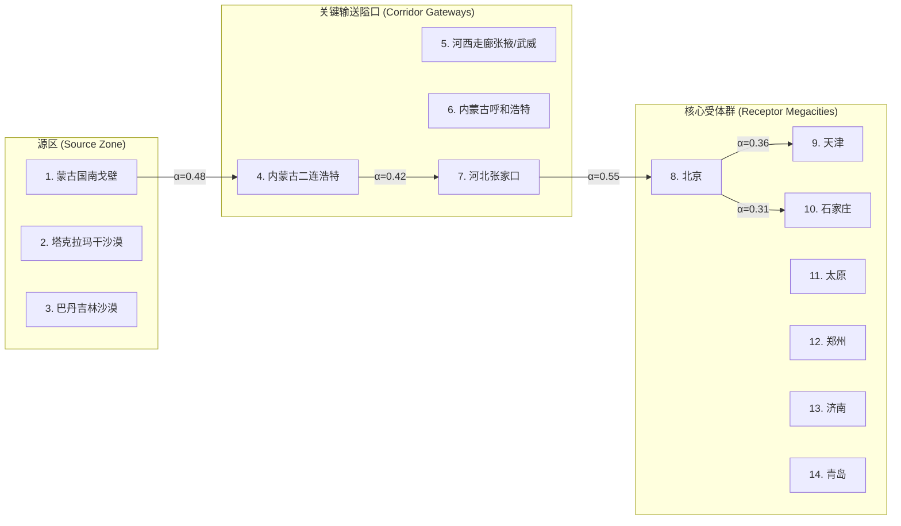

# 02 空间地理与遥感卫星核心图表规范 (Spatial & Remote Sensing Geographic Charts)

本规范为硕士学位论文第3、5、6章涉及的地理信息系统（GIS）、空间统计学以及遥感卫星影像反演的制图标准。

---

## 1. 普通克里金空间插值图与预测方差面 (Ordinary Kriging & Variance Surface)

### 1.1 学术目标与指标定义
- **目的**：将离散地面环境监测站点（MEE 站点）的逐小时 $\text{PM}_{10}$ 点位浓度转换为东亚区域连续空间浓度梯度分布，并附带插值不确定性评估。
- **制图构成（双子图标准）**：
  - **(a) 浓度插值面（Predicted Concentration Surface）**：采用等值线（Contour）加连续填色，色阶映射严格对应 CMA 沙尘等级（绿 $\to$ 黄 $\to$ 橙 $\to$ 红）；
  - **(b) 预测方差面（Kriging Standard Error Surface）**：直观展示站点稀疏区（如内蒙古西北部荒漠、腾格里沙漠边缘）的不确定性增益，证明模型评估的诚实度。

```
+------------------------------------+------------------------------------+
|  (a) OK Interpolated PM10 Grid     |  (b) Kriging Estimation Variance   |
|   [Source: Gobi -> High Plume]     |   [Sparse Station: Higher Error]   |
|      N                             |      N                             |
|      ^    ==== High Dust ====      |      ^      / / High Var / /       |
|      |    ---- Moderate -----      |      |     . . . Low Var . .      |
|      +--> E                        |      +--> E                        |
|   Scale: 0 100 200 km              |   Scale: 0 100 200 km              |
+------------------------------------+------------------------------------+
```

### 1.2 Python 发表级空间制图代码 (Cartopy + GeoPandas)
```python
import matplotlib.pyplot as plt
import cartopy.crs as ccrs
import cartopy.feature as cfeature
import numpy as np

def plot_spatial_kriging_cartopy(lon_grid, lat_grid, pm10_pred, kriging_std, 
                                stations_lon, stations_lat, save_path="fig_kriging_spatial.pdf"):
    fig, (ax1, ax2) = plt.subplots(1, 2, figsize=(14, 6), 
                                   subplot_kw={'projection': ccrs.LambertConformal(central_longitude=110, central_latitude=35)},
                                   dpi=300)
    
    extent = [95, 125, 30, 48] # 覆盖西北源区至华北受体区
    cmap_dust = plt.cm.YlOrRd
    cmap_var = plt.cm.Blues
    
    for ax, data, title, cmap, label in zip([ax1, ax2], 
                                            [pm10_pred, kriging_std], 
                                            ['(a) Ordinary Kriging $\mathrm{PM}_{10}$ ($\mu\mathrm{g}/\mathrm{m}^3$)', 
                                             '(b) Kriging Standard Error ($\mu\mathrm{g}/\mathrm{m}^3$)'],
                                            [cmap_dust, cmap_var],
                                            ['$\mathrm{PM}_{10}$ Conc.', 'Std. Error']):
        ax.set_extent(extent, crs=ccrs.PlateCarree())
        ax.add_feature(cfeature.COASTLINE.with_scale('50m'), linewidth=0.6, edgecolor='#333333')
        ax.add_feature(cfeature.BORDERS.with_scale('50m'), linestyle=':', linewidth=0.6)
        ax.add_feature(cfeature.RIVERS.with_scale('50m'), linewidth=0.4, edgecolor='#6baed6')
        
        # 绘制网格等值填色面
        cf = ax.contourf(lon_grid, lat_grid, data, levels=30, cmap=cmap, transform=ccrs.PlateCarree())
        cbar = fig.colorbar(cf, ax=ax, orientation='horizontal', pad=0.06, shrink=0.8)
        cbar.set_label(label, fontweight='bold', fontsize=9)
        
        # 叠加实际观测站点
        ax.scatter(stations_lon, stations_lat, s=12, c='black', marker='^', 
                   transform=ccrs.PlateCarree(), alpha=0.6, label='MEE Stations')
        ax.set_title(title, fontweight='bold', fontsize=11, pad=10)
        
    plt.tight_layout()
    plt.savefig(save_path, bbox_inches='tight')
    plt.close()
```

---

## 2. 空间自相关莫兰散点图与 LISA 聚类图 (Moran's I & LISA Map)

### 2.1 学术目标与指标定义
- **目的**：严谨论证沙尘暴在区域尺度上绝非独立随机分布，而是具备极高统计显著性的空间集聚特征（Spatial Autocorrelation）。
- **核心图件**：
  1. **Moran 散点图**：横轴为标准化特征值 $Z_i$，纵轴为空间滞后向量 $W Z_i$。散点回归线斜率即为 Global Moran's $I$；
  2. **Anselin Local Moran's I (LISA) 聚类地图**：
     - **High-High (红色)**：沙尘浓度高且周边邻域浓度也高的核心输送带（内蒙古中部 $\to$ 张家口 $\to$ 京津冀）；
     - **Low-Low (蓝色)**：秦岭以南或沿海清洁区；
     - **High-Low (天蓝)**：局部孤立强排放/工业起沙点；
     - **Low-High (粉红)**：重污染背景下的局地微气候避风港/湖泊湿地。

```
Spatial Lag (W*z)
       |
 Q2:   |   Q1: High-High (Corridor Cluster)
Low-High|       /   * * *
       |     /  * *
       |   /
-------+-----------------> Standardized Value (z)
       | /
       |/
 Q3:   |   Q4: High-Low (Outliers)
Low-Low|
```

---

## 3. 14节点动态输送通道拓扑图与风向矢量图 (14-Node Corridor Flow & Quiver)

### 3.1 学术目标与指标定义
- **目的**：直观展示 ST-GNN 模型中定义的 14 个宏观关键节点及动态学习到的气流传输通量（Edge Weight Matrix $A_t$）。
- **视觉要素**：
  - 14 个节点按物理经纬度锚定在地理底图上；
  - 节点大小正比于该节点的自注意力权重或实时排放强度；
  - 节点间有向箭头（Curved Directed Arrows）表示沙尘输送通道，线条粗细与透明度反映节点间的图注意力权重 $\alpha_{ij}$；
  - 底图叠加 ERA5 850 hPa 水平风场箭头（Quiver / Streamlines），证明图网络的学习结果与气象风向流场完全吻合。



---

## 4. 三维综合风险空间叠置制图 ($Risk = Hazard \times Exposure \times Vulnerability$)

### 4.1 学术目标与指标定义
- **目的**：落实“物理预报-空间暴露-社会决策”全链条闭环，在 GIS 中通过加权空间叠置分析（Spatial Multi-Criteria Evaluation）生成最终防灾减灾综合风险图。
- **图层构成**：
  1. **致灾因子危险性（Hazard, $H$）**：ST-GNN 输出的 5 级超标概率面；
  2. **承灾体暴露度（Exposure, $E$）**：基于 WorldPop $1\text{ km}$ 人口密度分布图与主干交通路网密度；
  3. **社会脆弱性（Vulnerability, $V$）**：基于民政与统计年鉴的 65 岁以上老人与幼童占比、人均重症床位及应急物资储备量；
  4. **综合风险等级**：划分为低风险（绿）、中风险（黄）、较高风险（橙）、极高风险（红），并对极高风险城市群进行特写放大框标引。

---

## 5. 气象卫星沙尘多光谱反演与分裂窗亮度差图 (Satellite Multispectral & BTD)

### 5.1 学术目标与指标定义
- **目的**：利用国家风云四号（FY-4A/B）或 MODIS 卫星反演图像，直观印证沙尘暴爆发与长距离输送的空中羽流范围。
- **必备遥感图件**：
  1. **WMO 标准 Dust RGB 假彩色合成图**：
     - 红色通道（Red）：$12.0\ \mu\text{m} - 10.8\ \mu\text{m}$ 亮温差（BTD）；
     - 绿色通道（Green）：$10.8\ \mu\text{m} - 8.7\ \mu\text{m}$ 亮温差；
     - 蓝色通道（Blue）：$10.8\ \mu\text{m}$ 热红外亮温；
     - **视觉呈现**：沙尘气溶胶在图像中呈现鲜明、独特的**洋红色（Magenta / Pinkish-Purple）**，而水汽云层呈黄色或红褐色，地表呈淡青色。
  2. **分裂窗红外亮度差（Split-Window BTD）梯度图**：
     - 当 $\Delta T = T_{11} - T_{12} < 0\text{ K}$ 时，由于硅酸盐粗粒子在 $11\ \mu\text{m}$ 强吸收特性，形成显著负值区，精准勾勒起沙前沿。
