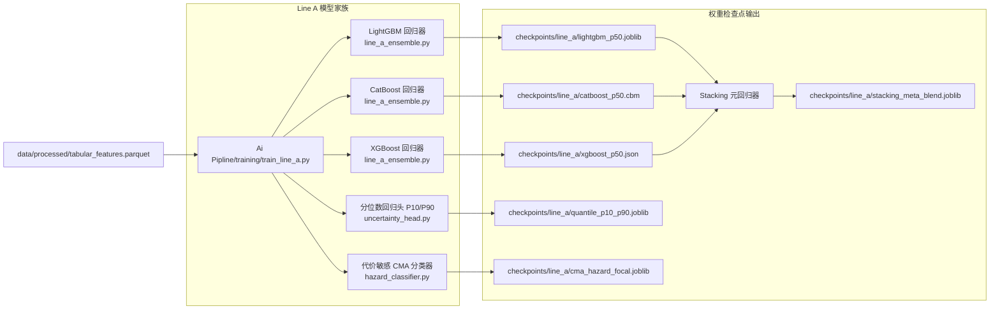

# 01 主线A：表格特征数据流向机器学习模型映射规范 (Line A Data-to-Model Pipeline)

本规范详述主线A（NWP统计订正与树集成模型）中从多源原始气象地面数据到特征工程宽表、各机器学习模型训练脚本、权重检查点及推理服务的完整端到端路径绑定。

---

## 1. 原始输入数据路径与字段定义 (Raw Data Sources)

| 数据源类型 | 物理存储路径 | 格式 | 核心提取字段 | 采集频率与分辨率 |
|:---|:---|:---:|:---|:---:|
| **MEE 地面空气质量监测站** | `data/raw/ground/mee_pm10_hourly_2020_2025.csv` | CSV | `station_id`, `datetime`, `pm10_obs`, `visibility_km` | 逐小时，14个核心监测站点 |
| **ECMWF IFS 气压层预报场** | `data/raw/nwp/ecmwf_ifs_surface_3to15d.nc` | NetCDF | `u10`, `v10`, `fg10` (阵风), `t2m`, `blh` (边界层高), `sp` (气压) | 逐6小时，0.1°×0.1° 网格 |
| **ERA5 表层陆面土壤数据** | `data/raw/nwp/era5_land_soil_moisture.nc` | NetCDF | `swvl1` (0-7cm土壤湿度), `stl1` (地表温度) | 逐小时，0.1°×0.1° 网格 |
| **MODIS/Terra 气溶胶光学厚度** | `data/raw/satellite/modis_mcd19a2_aod_daily.hdf` | HDF4/5 | `Optical_Depth_055` (AOD 550nm) | 逐日，1km 分辨率 |
| **SRTM 数字高程模型** | `data/raw/gis/srtm_dem_90m_north_china.tif` | GeoTIFF | `elevation_m`, `slope`, `aspect` | 静态 90m |

---

## 2. 特征工程处理脚本与规整宽表缓存 (Processed Feature Store)

### 2.1 清洗与特征工程执行脚本
- **执行脚本文件**：`scripts/data/build_line_a_tabular_dataset.py`
- **调用逻辑**：
  1. 读取地面站点坐标，双线性插值提取 ECMWF 及 ERA5 对应格点气象要素；
  2. 计算欧文跃移临界阈值超额度 $u_* - u_{*t}$；
  3. 计算风-湿交互干燥指数 $\text{wind\_u10} / (\text{soil\_moisture} + 10^{-4})$；
  4. 计算卫星 AOD 与大气边界层高度比率 $\text{AOD} / (\text{BLH} + 10)$；
  5. 按时间窗口（滚动 $3 \sim 15$ 天）构造前瞻预报目标标签（Target Leads）。

### 2.2 产出的规整宽表存储路径
- **目标宽表文件**：`data/processed/tabular_features.parquet`
- **数据矩阵结构**：`[N_samples * 14_stations, 17_features]`
- **特征模式清单（Feature Schema）**：
  ```python
  BASE_FEATURES = [
      "wind_u10", "u_star", "u_star_t", "soil_moisture",
      "temp_k", "blh", "aod", "nwp_pm10", "visibility_km",
      "elevation_m", "lat", "lon"
  ]
  ENGINEERED_FEATURES = [
      "friction_velocity_excess",  # np.maximum(0.0, u_star - u_star_t)
      "saltation_active_flag",     # (u_star > u_star_t).astype(float)
      "dryness_wind_interaction",  # wind_u10 / (soil_moisture + 1e-4)
      "nwp_bias_proxy",            # nwp_pm10 / (visibility_km + 1.0)
      "aod_blh_ratio"              # aod / (blh + 10.0)
  ]
  TARGET_COLS = ["target_pm10_24h", "target_pm10_72h", "target_pm10_120h", "target_pm10_168h", "hazard_class"]
  ```

---

## 3. 模型训练对接与检查点存储路径 (Model Training & Checkpoints)



### 3.1 训练脚本与代码映射表
| 模型角色 | 核心执行代码文件 | 调用的输入类与函数 | 产出的模型权重检查点绝对路径 |
|:---|:---|:---|:---|
| **LightGBM 基学习器** | `Ai Pipline/models/machine_learning/line_a_ensemble.py` | `LineAEnsemble.fit(X_train, y_train)` | `Ai Pipline/models/checkpoints/line_a/lightgbm_p50.joblib` |
| **CatBoost 基学习器** | `Ai Pipline/models/machine_learning/line_a_ensemble.py` | `CatBoostRegressor.fit()` | `Ai Pipline/models/checkpoints/line_a/catboost_p50.cbm` |
| **XGBoost 基学习器** | `Ai Pipline/models/machine_learning/line_a_ensemble.py` | `XGBRegressor.fit()` | `Ai Pipline/models/checkpoints/line_a/xgboost_p50.json` |
| **Stacking 融合器** | `Ai Pipline/models/machine_learning/line_a_ensemble.py` | `RidgeCV.fit(base_preds, y_train)` | `Ai Pipline/models/checkpoints/line_a/stacking_meta_blend.joblib` |
| **不确定性分位数头** | `Ai Pipline/models/machine_learning/uncertainty_head.py` | `UncertaintyHead.fit(X_train, y_train)` | `Ai Pipline/models/checkpoints/line_a/quantile_p10_p90.joblib` |
| **CMA 5级分类器** | `Ai Pipline/models/machine_learning/hazard_classifier.py` | `HazardClassifier.fit(X_train, hazard_train)` | `Ai Pipline/models/checkpoints/line_a/cma_hazard_focal.joblib` |

---

## 4. 在线推理服务与 API 接口挂载 (Serving Integration)

- **API 驱动代码**：`Ai Pipline/api/app.py`
- **加载逻辑**：
  ```python
  from models.machine_learning.line_a_ensemble import LineAEnsemble
  from models.machine_learning.uncertainty_head import UncertaintyHead
  from models.machine_learning.hazard_classifier import HazardClassifier

  # 服务启动时预加载检查点权重
  model_ensemble = LineAEnsemble.load("models/checkpoints/line_a/stacking_meta_blend.joblib")
  model_quantile = UncertaintyHead.load("models/checkpoints/line_a/quantile_p10_p90.joblib")
  model_hazard = HazardClassifier.load("models/checkpoints/line_a/cma_hazard_focal.joblib")
  ```
- **对外暴露端点**：
  - `POST /api/v1/forecast/line-a/single-station`
  - `POST /api/v1/forecast/line-a/regional-batch`
  - **响应格式**：包含 $P_{10}, P_{50}, P_{90}$ 浓度区间与 CMA 5级预警分类概率分布向量。
