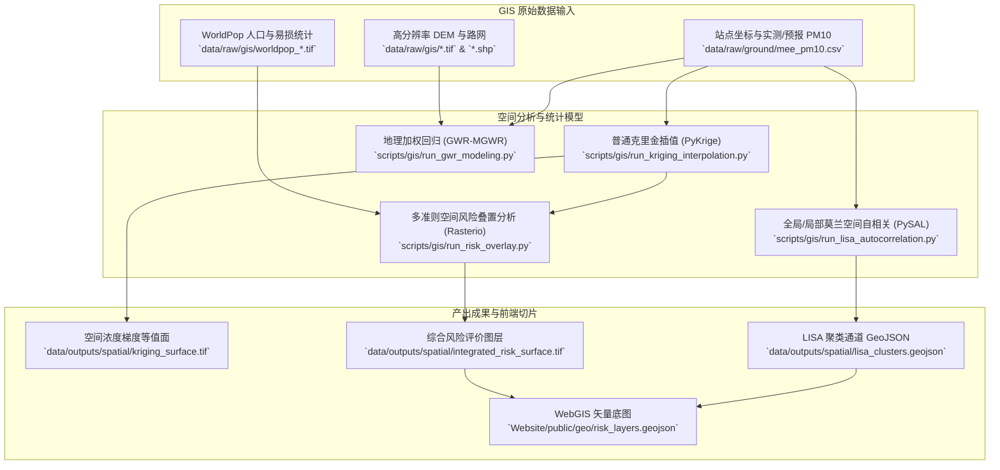

# 03 空间地理与 GIS 空间统计模型映射规范 (GIS Spatial Analytics Pipeline)

本规范详述地理信息系统（GIS）与空间分析模块中从地表站点矢量点位、遥感高程栅格到普通克里金空间插值、空间自相关（Moran's I/LISA）、地理加权回归（GWR）及多准则综合风险制图的完整文件路径连接。

---

## 1. 原始空间矢量与遥感栅格路径清单 (Raw GIS Sources)

| 数据图层名称 | 原始物理文件路径 | 数据类型与格式 | 空间参考坐标系 (CRS) |
|:---|:---|:---:|:---:|
| **国家监测站点坐标点** | `data/raw/gis/mee_stations_locations.shp` | 矢量点要素 (Point) | WGS 84 (EPSG:4326) |
| **中国行政区划边界** | `data/raw/gis/china_admin_boundaries.shp` | 矢量多边形 (Polygon) | CGCS 2000 (EPSG:4490) |
| **SRTM 数字高程模型** | `data/raw/gis/srtm_dem_90m_north_china.tif` | 单波段栅格 (GeoTIFF) | WGS 84 (EPSG:4326) |
| **WorldPop 人口密度格网** | `data/raw/gis/worldpop_china_2024_1km.tif` | 浮点型栅格 (GeoTIFF) | WGS 84 (EPSG:4326) |
| **MODIS 土地利用覆盖** | `data/raw/gis/modis_mcd12q1_lucc_2024.tif` | 分类整数栅格 (GeoTIFF) | IGBP 分类体系 |
| **主干交通路网矢量** | `data/raw/gis/osm_highways_north_china.shp` | 矢量折线 (LineString) | WGS 84 (EPSG:4326) |

---

## 2. 空间处理脚本与空间统计模型映射 (Spatial Scripts & Models)

### 2.1 核心脚本与模型对接矩阵表
| 空间统计任务 | 核心实现脚本文件 | 核心函数/库 | 产出的栅格/矢量成果绝对路径 |
|:---|:---|:---|:---|
| **普通克里金空间插值** | `scripts/gis/run_kriging_interpolation.py` | `PyKrige.ok.OrdinaryKriging` | `data/outputs/spatial/kriging_pm10_grid.tif` `data/outputs/spatial/kriging_variance.tif` |
| **空间自相关检验 (LISA)** | `scripts/gis/run_lisa_autocorrelation.py` | `esda.moran.Moran_Local` | `data/outputs/spatial/lisa_clusters.geojson` `data/outputs/spatial/moran_scatterplot.pdf` |
| **地理加权回归 (GWR)** | `scripts/gis/run_gwr_modeling.py` | `mgwr.gwr.GWR` | `data/outputs/spatial/gwr_local_coefficients.shp` `data/outputs/spatial/gwr_r2_surface.tif` |
| **综合风险空间叠置** | `scripts/gis/run_risk_overlay.py` | `rasterio.calc` ($H \times E \times V$) | `data/outputs/spatial/integrated_risk_map.tif` `Website/public/geo/risk_heatmap.json` |

---

## 3. 前端 WebGIS 瓦片服务对接 (Frontend WebGIS Integration)

- **前端读取路径**：
  - 静态 GeoJSON：`Website/public/geo/lisa_corridors.geojson`
  - 动态风险热力栅格切片：`Website/public/geo/risk_raster_tiles/{z}/{x}/{y}.png`
- **React 组件挂载文件**：
  - `Website/src/components/SpatialRiskMap.tsx`
  - 采用 Mapbox GL / Leaflet 动态切换致灾危险性（Hazard）、承灾暴露度（Exposure）与综合风险（Risk）图层。
