# 04 社会调查与 SPSS / AMOS 心理计量模型映射规范 (SPSS & AMOS Survey Pipeline)

本规范详述社会易损性实证研究与公众保护行动决策（PADM）模块中，从原始调查问卷、SPSS 清洗过滤脚本、探索性因子分析（EFA）到 AMOS 验证性因子分析（CFA）及全结构方程模型（SEM）的完整路径流转。

---

## 1. 原始调查问卷数据与变量字典路径 (Raw Survey Files)

| 资料文件名称 | 物理存储路径 | 格式 | 内容与用途 |
|:---|:---|:---:|:---|
| **原始公众问卷数据集** | `data/raw/survey/public_questionnaire_raw.sav` | SPSS Data (.sav) | 收集自华北受沙尘影响重点城市的 920 份原始填答记录 |
| **调查变量编码字典** | `data/raw/survey/survey_codebook.xlsx` | Excel (.xlsx) | 题项代号（WP1-3, RP1-3, SA1-2, PA1-3）与李克特5点量表对应表 |
| **人口统计学分群定义** | `data/raw/survey/demographic_categories.json` | JSON | 年龄段、职业户外暴露度、慢性呼吸道病史分类编码 |

---

## 2. SPSS 清洗脚本与规整样本缓存 (SPSS Cleaning Pipeline)

```mermaid
graph LR
    R["data/raw/survey/public_questionnaire_raw.sav"] --> S1["scripts/spss/01_screening_and_outliers.sps"]
    
    subgraph "SPSS 质检清洗流程"
        S1 -->|"填答时长 < 120s / 规律作答删除"| C1["无效样本剔除"]
        C1 -->|"马氏距离 D² (p < 0.001)"| C2["多元异常值筛除"]
        C2 -->|"正态性峰度绝对值 < 7, 偏度 < 2"| C3["正态分布检验合格"]
    end
    
    C3 --> P["data/processed/survey/clean_survey_n842.sav"]
    P --> S2["scripts/spss/02_reliability_and_efa.sps"]
    S2 -->|"Cronbach α ≥ 0.70<br>KMO ≥ 0.80"| O["data/outputs/survey/efa_factor_loadings.csv"]
```

### 2.1 SPSS 脚本与中间产物清单
- **第一阶段清洗语法脚本**：`scripts/spss/01_screening_and_outliers.sps`
  - 剔除短时随意填答（$< 120\text{s}$）与零方差直线填答（Straight-lining）；
  - 计算马氏距离（Mahalanobis $D^2$），剔除极端离群值，最终保留 **$N = 842$ 份高质量有效样本**。
- **合格清洗数据集输出路径**：`data/processed/survey/clean_survey_n842.sav`
- **第二阶段信效度语法脚本**：`scripts/spss/02_reliability_and_efa.sps`
  - 测算 Cronbach's $\alpha$ 信度与基于主轴因子法的 EFA 因子载荷。

---

## 3. AMOS 结构方程模型工程文件对接 (AMOS SEM Modeling)

### 3.1 AMOS 模型工程与结果输出映射表
| 模型分析阶段 | 物理工程文件路径 | 执行操作与检验目标 | 输出学术成果路径 |
|:---|:---|:---|:---|
| **验证性因子分析 (CFA)** | `models/amos/padm_cfa_model.amw` | 检验 4 大潜变量的 AVE ($>0.50$)、CR ($>0.70$) 与判别效度 | `data/outputs/survey/cfa_fit_indices.csv` `data/outputs/survey/factor_validity_matrix.xlsx` |
| **全结构方程模型 (SEM)** | `models/amos/padm_full_sem.amw` | 检验预警感知 $\to$ 风险认知 $\to$ 避险行为的因果路径系数 $\beta$ | `data/outputs/survey/sem_standardized_estimates.csv` `models/amos/padm_sem_diagram.pdf` |
| **Bootstrap 中介效应分析** | `scripts/spss/03_hayes_process_mediation.sps` | 执行 Hayes PROCESS Model 4（5000 次重抽样，95% 置信区间） | `data/outputs/survey/bootstrap_mediation_5000.csv` `Planning/Charts/fig_bootstrap_mediation.pdf` |

---

## 4. 调查结果向 GIS 易损性图层与决策系统反馈 (Cross-Pillar Feedback)

- **社会易损性权重反馈（Feedback to GIS Vulnerability $V$）**：
  - AMOS 模型计算出不同人群（如老年人群、儿童、户外劳动者）在沙尘暴露下的风险感知与防护执行力系数差异；
  - 提取标准化权重矩阵保存至 `data/processed/spatial/vulnerability_weights.json`；
  - 直接输入给 GIS 空间分析脚本 `scripts/gis/run_risk_overlay.py`，作为多准则综合风险评估中的 $V$ 因子层。
- **论文与决策成果输出**：
  - 成果数据直接支撑硕士论文第5章全部图表，并映射至智慧城市应急大屏 `Website/src/components/SocioeconomicPanel.tsx`。
