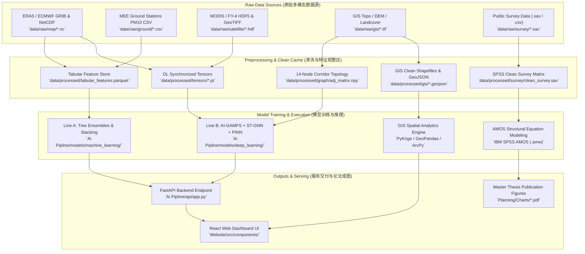

# 🔗 数据流与模型端到端路径连接总纲 (Master Data-to-Model Pipeline Architecture)

本规范为本项目（DustML 沙尘暴中长期预报与应急减灾平台）的**核心数据流与模型调用路径总纲（Data-to-Model Path Manifest）**。
旨在解决工程落地与学术复现中“哪个文件输入给哪个模型、中间产物保存在哪里、检查点权重与输出特征如何流转”的关键技术接口问题。

---

## 🗺️ 全局数据流到模型总拓扑图 (Global Data-to-Model Topology)



---

## 📂 核心子模块路径映射指南 (Module Guides Index)

| 指南文档 | 涵盖模型与算法 | 核心输入数据路径与格式 | 核心模型代码与权重保存路径 |
|:---|:---|:---|:---|
| **[`01_LINE_A_TABULAR_MODELS.md`](file:///c:/Users/hp/Desktop/China_project/Planning/Connceting_data_to_model/01_LINE_A_TABULAR_MODELS.md)** | LightGBM、CatBoost、XGBoost、分位数回归 ($P_{10}/P_{50}/P_{90}$)、CMA 5级灾害分类器、Stacking 集成元模型 | `data/processed/tabular_features.parquet`<br>`data/raw/ground/mee_pm10_hourly.csv`<br>`data/raw/nwp/ecmwf_ifs_surface.nc` | `Ai Pipline/models/machine_learning/line_a_ensemble.py`<br>`Ai Pipline/models/machine_learning/uncertainty_head.py`<br>`Ai Pipline/models/machine_learning/hazard_classifier.py`<br>`checkpoints/line_a/stacking_blend.joblib` |
| **[`02_LINE_B_DEEP_TENSORS.md`](file:///c:/Users/hp/Desktop/China_project/Planning/Connceting_data_to_model/02_LINE_B_DEEP_TENSORS.md)** | AI-GAMFS 视觉主干、14节点时空图神经网络 (ST-GNN)、PINN 欧文跃移与质量守恒损失、Unified Deep Model | `data/processed/tensors/nwp_grid_16x16.pt`<br>`data/processed/tensors/sat_grid_32x32.pt`<br>`data/processed/graph/adj_matrix.npy`<br>`data/processed/tensors/seq_history_24h.pt` | `Ai Pipline/models/deep_learning/aigamfs_backbone.py`<br>`Ai Pipline/models/deep_learning/st_gnn.py`<br>`Ai Pipline/models/deep_learning/pinn_core.py`<br>`Ai Pipline/models/deep_learning/unified_model.py`<br>`checkpoints/line_b/best_unified_model.pth` |
| **[`03_GIS_SPATIAL_ANALYTICS.md`](file:///c:/Users/hp/Desktop/China_project/Planning/Connceting_data_to_model/03_GIS_SPATIAL_ANALYTICS.md)** | 普通克里金 (OK) 空间插值、Moran's $I$ 与 LISA 局部聚类、GWR 地理加权回归、三维综合风险叠置 ($H \times E \times V$) | `data/raw/gis/station_locations.shp`<br>`data/raw/gis/srtm_dem_north_china.tif`<br>`data/raw/gis/worldpop_china_2024.tif`<br>`data/processed/spatial/pm10_surface.tif` | `scripts/gis/run_kriging_interpolation.py`<br>`scripts/gis/run_spatial_autocorrelation.py`<br>`scripts/gis/run_risk_overlay.py`<br>`data/outputs/spatial/final_risk_map.geojson` |
| **[`04_SPSS_AMOS_SURVEY_MODELS.md`](file:///c:/Users/hp/Desktop/China_project/Planning/Connceting_data_to_model/04_SPSS_AMOS_SURVEY_MODELS.md)** | 问卷清洗与正态性检验、探索性因子分析 (EFA)、验证性因子分析 (CFA)、结构方程模型 (SEM)、Bootstrap 中介检验 | `data/raw/survey/public_questionnaire_raw.sav`<br>`data/processed/survey/clean_survey_n842.sav`<br>`data/raw/survey/survey_codebook.xlsx` | `scripts/spss/01_data_cleaning_and_efa.sps`<br>`models/amos/padm_cfa_model.amw`<br>`models/amos/padm_full_sem.amw`<br>`data/outputs/survey/sem_standardized_estimates.csv` |

---

## 🛠️ 数据目录工程标准结构 (Target Directory Layout)

项目根目录下必须设立标准化数据与检查点缓存目录：

```
China_project/
├── data/
│   ├── raw/                           # 原始不可变数据存储区
│   │   ├── nwp/                       # ECMWF / CMA 数值天气预报 NetCDF
│   │   ├── ground/                    # 生态环境部 MEE 站点 PM10 CSV
│   │   ├── satellite/                 # 风云4号 / MODIS 卫星 HDF/TIFF
│   │   ├── gis/                       # 遥感DEM、行政边界、土地利用 Shapefile/GeoTIFF
│   │   └── survey/                    # 842份社会感知问卷原始 SPSS .sav
│   ├── processed/                     # 清洗规整后特征库与张量缓存
│   │   ├── tabular_features.parquet   # Line A 训练所用宽表特征
│   │   ├── tensors/                   # Line B PyTorch 张量缓存 (.pt)
│   │   ├── graph/                     # 14节点邻接拓扑矩阵 (.npy, .json)
│   │   ├── spatial/                   # 插值栅格与矢量图层
│   │   └── survey/                    # 清洗合格问卷矩阵
│   └── outputs/                       # 预测成果与成图产物
├── Ai Pipline/
│   ├── models/
│   │   ├── checkpoints/               # 训练好的模型权重 Checkpoints
│   │   │   ├── line_a/                # LightGBM/CatBoost .joblib 权重
│   │   │   └── line_b/                # PyTorch .pth 深度模型权重
│   │   ├── machine_learning/          # Line A 代码
│   │   └── deep_learning/             # Line B 代码
│   ├── data/
│   │   └── dataset.py                 # 数据加载与管道转换中枢
│   └── api/
│       └── app.py                     # FastAPI 在线服务暴露中枢
```
