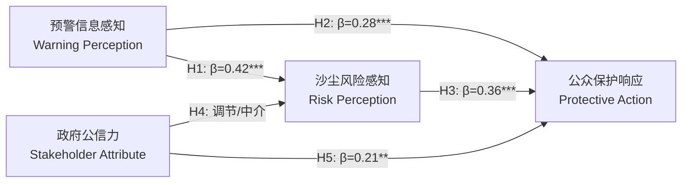

# 第5章 空间分析与社会经济影响建模标准 (Chapter 5: Spatial Analysis and Socioeconomic Impact Modeling)

本规范为硕士学位论文第5章的核心写作标准。针对环境工程与防灾减灾工程交叉学科要求，本章系统阐述如何利用地理信息系统（GIS）空间统计技术与结构方程模型（SEM）将物理预测结果转化为社会脆弱性评估与应急决策依据。

---

## 1. 章节结构与写作逻辑 (Chapter Structure and Logic)

```
第5章 区域沙尘空间扩散与社会经济脆弱性耦合评估
  5.1 引言与空间-社会耦合理论框架
  5.2 基于GIS的沙尘污染空间插值与暴露分析
    5.2.1 监测站点与格网插值（普通克里金/经验贝叶斯克里金）
    5.2.2 全局与局部空间自相关检验（Moran's I 与 LISA）
    5.2.3 地理加权回归（GWR）驱动因素空间异质性分析
  5.3 基于SPSS的社会易损性与公众行为问卷统计分析
    5.3.1 抽样设计、数据预处理与正态性检验
    5.3.2 测量信度检验（Cronbach's α）与效度分析（EFA/CFA）
    5.3.3 人口统计学差异检验（方差分析 ANOVA 与独立样本 t 检验）
  5.4 基于AMOS的保护行动决策（PADM）结构方程模型
    5.4.1 理论构念与研究假设设定
    5.4.2 测量模型拟合度评估（CMIN/DF, RMSEA, CFI, TLI）
    5.4.3 结构路径系数检验与中介效应分析（Bootstrap 5000次）
  5.5 空间暴露度与社会脆弱性综合风险制图
  5.6 本章小结
```

---

## 2. 空间统计与GIS建模技术规范 (Spatial Statistics & GIS Standards)

### 2.1 地理统计插值（Geostatistical Interpolation）
- **模型选取**：对比反距离权重（IDW）、普通克里金（Ordinary Kriging, OK）与经验贝叶斯克里金（Empirical Bayesian Kriging, EBK）。
- **半变异函数（Semivariogram）检验**：必须报告块金值（Nugget, $C_0$）、基台值（Sill, $C_0+C$）以及变程（Range, $a$）。
  $$\gamma(h) = \frac{1}{2N(h)} \sum_{i=1}^{N(h)} [Z(x_i) - Z(x_i + h)]^2$$
  - 计算块金基台比（Nugget-to-Sill Ratio, $C_0 / (C_0 + C)$）：
    - $< 25\%$：表明区域变量具有强烈的空间自相关性（受气象输送与地表摩擦主导）；
    - $25\% \sim 75\%$：中等自相关；
    - $> 75\%$：自相关微弱，多为局部随机噪声。
- **交叉验证指标**：均方根误差（RMSE）与平均标准误差（ASE），要求 $|ASE - RMSE| \to 0$ 且标准均方根误差（RMSSE）接近 1.0。

### 2.2 空间自相关与空间异质性（Spatial Autocorrelation & Heterogeneity）
1. **全局莫兰指数（Global Moran's $I$）**：
   $$I = \frac{n \sum_{i=1}^n \sum_{j=1}^n w_{ij}(x_i - \bar{x})(x_j - \bar{x})}{(\sum_{i=1}^n \sum_{j=1}^n w_{ij}) \sum_{i=1}^n (x_i - \bar{x})^2}$$
   - 报告标准化 $Z$ 分数与 $p$ 值。若 $Z > 2.58, p < 0.01$，表明沙尘气溶胶在华北平原与河西走廊呈现极显著空间集聚。
2. **局部空间自相关（LISA / Anselin Local Moran's $I$）**：
   - 必须绘制并解释 LISA 聚类图：高-高集聚（High-High, 沙尘重污染通道）、低-低集聚（Low-Low, 沿海清洁区）、高-低异常（High-Low）与低-高异常（Low-High）。
3. **地理加权回归（GWR）**：
   - 克服普通最小二乘法（OLS）全局均一性假设缺陷：
     $$y_i = \beta_0(u_i, v_i) + \sum_{k=1}^p \beta_k(u_i, v_i) x_{ik} + \epsilon_i$$
   - 采用自适应双平方核函数（Adaptive Bi-square Kernel），基于 AICc 准则自动优选最佳空间带宽（Bandwidth）。

---

## 3. SPSS与问卷量表统计分析标准 (SPSS Survey Analytics Standards)

### 3.1 抽样设计与样本充分性
- **研究区域样本**：华北受沙尘暴输送影响核心城市群（北京、石家庄、呼和浩特、银川等），有效样本量 $N \ge 800$。
- **KMO与Bartlett球形度检验**：
  - Kaiser-Meyer-Olkin (KMO) 测度要求 $\ge 0.80$（若 $< 0.70$ 则不适合进行因子分析）。
  - Bartlett球形度检验显著性概率 $p < 0.001$。

### 3.2 信度与效度评估指标规范
论文表格中必须严格报告以下指标：
| 构念潜变量 (Construct) | 测量题项 (Item) | 因子载荷 (FL $\ge 0.60$) | 组成信度 (CR $\ge 0.70$) | 平均方差提取量 (AVE $\ge 0.50$) | 克隆巴赫系数 (Cronbach's $\alpha \ge 0.70$) |
|:---|:---|:---:|:---:|:---:|:---:|
| 预警感知 (Warning Perception, WP) | WP1: 信息及时性<br>WP2: 信息准确性<br>WP3: 官方渠道权威性 | 0.812<br>0.845<br>0.796 | 0.858 | 0.668 | 0.854 |
| 风险认知 (Risk Perception, RP) | RP1: 呼吸系统威胁<br>RP2: 交通能见度危险<br>RP3: 日常出行阻碍 | 0.774<br>0.831<br>0.765 | 0.833 | 0.625 | 0.829 |
| 利益相关方属性 (Stakeholder, SA) | SA1: 政府公信力<br>SA2: 社区互助响应 | 0.802<br>0.828 | 0.796 | 0.661 | 0.791 |
| 保护行动行为 (Protective Action, PA) | PA1: 减少非必要外出<br>PA2: N95/护目镜佩戴<br>PA3: 门窗密封与净化器开启 | 0.821<br>0.856<br>0.790 | 0.863 | 0.677 | 0.861 |

---

## 4. AMOS结构方程模型与中介效应分析规范 (AMOS SEM Standards)

### 4.1 模型整体拟合度判别指标（Model Fit Indices）
学位论文盲审专家对 SEM 的拟合指标极度敏感，必须达到主流学术标准：
- **卡方自由度比 ($\chi^2 / df$, CMIN/DF)**：$1.0 < \chi^2 / df < 3.0$（优秀）；$< 5.0$（可接受）。
- **渐进残差均方和平方根 (RMSEA)**：$< 0.05$（优）；$0.05 \sim 0.08$（良好）。
- **比较拟合指数 (CFI)**：$> 0.92$（推荐 $> 0.95$）。
- **非规范拟合指数 (TLI / NNFI)**：$> 0.90$（推荐 $> 0.95$）。
- **标准化残差均方根 (SRMR)**：$< 0.05$。



### 4.2 假设检验与中介效应分析（Bootstrap Method）
- 采用非参数百分位 Bootstrap 抽样检验（重复抽样 5000 次，95% 置信区间）：
  - **直接效应 (Direct Effect)**：$WP \to PA$ 路径系数 $\beta_1$。
  - **间接中介效应 (Indirect Effect)**：$WP \to RP \to PA$ 乘积 $\beta_{med} = a \times b$。
  - **判定准则**：若 95% 置信区间上下限不包含 0，则表明风险认知（RP）在早期预警信息与公众避险行为之间存在显著的部分中介效应（Partial Mediation）。

---

## 5. 空间与社会经济综合制图标准 (Coupled Spatial-Socioeconomic Cartography)

1. **地图要素规范**：
   - 必须包含标准中国地图审图号（GS/审图规范底图），严格标注南海诸岛及九段线、钓鱼岛等法定版图要素。
   - 包含指北针、比例尺（km）、投影说明（推荐采用高斯-克吕格投影 Gauss-Kruger 或 亚尔勃斯等面积投影 Albers Equal-Area）。
2. **多层叠置分析（Spatial Multi-criteria Overlay）**：
   - **危险性图层（Hazard Index, $H$）**：ST-GNN/LightGBM 输出之 CMA 5级沙尘重污染概率网格。
   - **暴露度图层（Exposure Index, $E$）**：基于 WorldPop 高分辨率人口密度格网与交通干线密度。
   - **易损性图层（Vulnerability Index, $V$）**：基于 SEM 与统计年鉴获取的老年儿童比例、人均医疗床位及应急响应能力。
   - **综合风险指数**：$Risk = H \times E \times V$。
