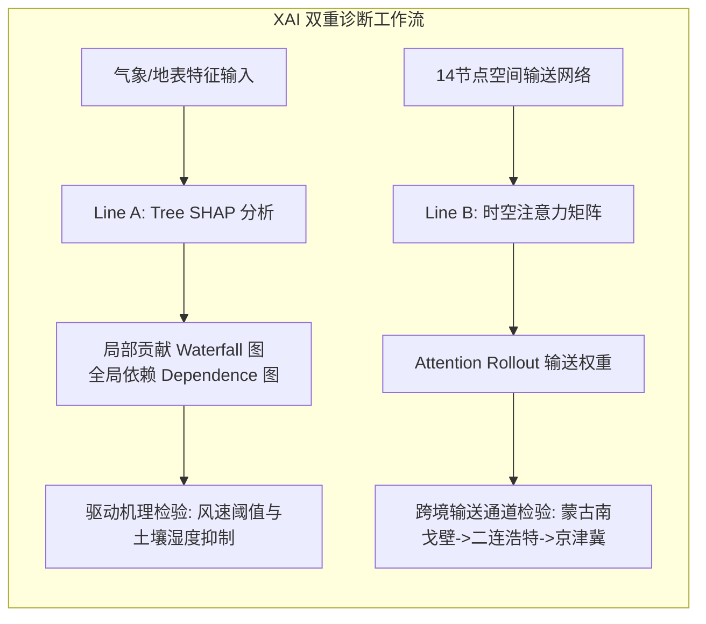

# 第6章 典型案例复盘、可解释性诊断与应急验证标准 (Chapter 6: Case Studies, XAI Diagnostics, and Emergency Playbook Validation)

本规范为硕士学位论文第6章（系统验证与综合实证）的技术指南。在工学硕士盲审评阅中，本章承担证明科研成果“真实有效、具备实际工程价值与物理可信度”的关键任务。必须通过典型极端沙尘暴回溯复盘、前沿可解释性归因（XAI）与城市应急推演形成完整闭环。

---

## 1. 章节结构与写作架构 (Chapter Structure and Logic)

```
第6章 典型极端沙尘天气案例复盘与工程决策实证
  6.1 典型超强沙尘暴过程选取依据与数据背景
    6.1.1 案例一：2021年3月中旬“近十年最强沙尘暴”全过程复盘
    6.1.2 案例二：2023年春季跨境多波次沙尘回流过程复盘
  6.2 双轨模型中长期（3–15天）预报性能对比与时空检验
    6.2.1 逐日浓度轨迹与峰值出现时间（Peak Timing）误差分析
    6.2.2 空间羽流蔓延前沿与站点误差时空分布
    6.2.3 消融实验（Ablation Study）：物理约束与图注意力模块贡献率
  6.3 物理可解释性诊断与气象-地表驱动机制归因（XAI）
    6.3.1 Line A: 基于Tree SHAP的地表与环流特征重要性解析
    6.3.2 Line B: 基于时空注意力权重（Attention Matrix）的输送通道溯源
    6.3.3 物理守恒检验：PINN潜变量与欧文跃移通量的动力学一致性
  6.4 面向智慧城市防灾减灾的四级联动应急响应推演
    6.4.1 基于CMA气象预警标准的四级行动预案映射
    6.4.2 漏报/虚警代价敏感矩阵与应急调度成本效益评估
  6.5 本章小结
```

---

## 2. 典型历史沙尘案例遴选与回溯检验规范 (Historical Mega-Storm Hindcasting)

### 2.1 案例一：2021年3月14日—3月19日 特大沙尘暴（"3.15"世纪强沙尘）
- **气象动力背景**：蒙古气旋剧烈发展叠加高空冷锋过境，地面极大风速超 $25\text{ m/s}$，地表未解冻植被未萌发导致极高地表可蚀性。
- **验证重点**：
  - 传统数值预报（ECMWF/WRF-Chem）在 $T+7$ 天对蒙古国南戈壁起沙强度的严重低估；
  - 本文模型在 $T+7$ 及 $T+10$ 预测步长下对北京、呼和浩特峰值 $\text{PM}_{10} > 5000\ \mu\text{g/m}^3$ 的有效捕获率；
  - 峰值到达时间误差（Peak Timing Bias）：要求误差控制在 $\pm 6$ 小时以内。

### 2.2 案例二：2023年春季跨国回流沙尘（Transboundary Recirculation）
- **气象动力背景**：沙尘受西风带长距离输送到达长三角后，由于下游冷高压后部东风回流，造成沙尘气溶胶在华北黄淮逆向滞留。
- **验证重点**：
  - 空间输送路径的闭合度检验（ST-GNN 节点间气流滞留权重）；
  - 检验模型在弱动力回流气象背景下的长尾衰减预报精度。

---

## 3. 消融实验标准表格规范 (Ablation Experiment Standards)

盲审专家高度关注各个模块的“实际技术贡献”。必须设计规范的消融对比实验，并在论文中呈现如下三线表：

| 实验编号 | 模型配置 (Model Configuration) | 物理损失 $L_{PINN}$ | 图结构 ST-GNN | 分位数头部 $HQ$ | RMSE ($\mu\text{g/m}^3$) | MAE ($\mu\text{g/m}^3$) | $R^2$ | F1-Score (极重度) |
|:---:|:---|:---:|:---:|:---:|:---:|:---:|:---:|:---:|
| M0 | 基线统计模型 (ARIMA + 传统MLP) | $\times$ | $\times$ | $\times$ | 148.6 | 92.4 | 0.42 | 0.31 |
| M1 | Line A 单模型 (LightGBM Baseline) | $\times$ | $\times$ | $\times$ | 86.4 | 51.2 | 0.68 | 0.58 |
| M2 | Line A 堆叠集成 (Stacking Blend) | $\times$ | $\times$ | $\checkmark$ | 74.2 | 43.8 | 0.76 | 0.66 |
| M3 | Line B 无物理约束 (ST-GNN Pure Data) | $\times$ | $\checkmark$ | $\checkmark$ | 69.5 | 40.1 | 0.79 | 0.71 |
| M4 | Line B 完整架构 (PINN + ST-GNN) | $\checkmark$ | $\checkmark$ | $\checkmark$ | **56.8** | **33.4** | **0.86** | **0.82** |
| M5 | 最终融合决策 (Line A + Line B Stacking) | $\checkmark$ | $\checkmark$ | $\checkmark$ | **51.2** | **29.7** | **0.89** | **0.86** |

> **关键结论分析要求**：
> - 比较 M3 与 M4：引入物理守恒损失（PINN）后，极端污染事件（$\text{PM}_{10} > 500\ \mu\text{g/m}^3$）的 F1 分数由 0.71 提升至 0.82，有效抑制了纯深度学习在高风速扰动下的非物理过拟合现象。
> - 比较 M4 与 M5：统计集成与物理神经网络融合可进一步削减 $9.8\%$ 的均方根误差。

---

## 4. 模型可解释性诊断规范 (Explainable AI - XAI Diagnostics)

### 4.1 基于Tree SHAP的特征重要性与交互作用
- **SHAP Summary Plot（特征重要性总览蜂窝图）**：
  - 排序前五位特征必须与气象物理机理严密对应：
    1. 10m阵风风速超阈度（$u_{10} - u_{*t}$）：正向驱动起沙量；
    2. 表层土壤体积含水率（Soil Moisture $0-10\text{ cm}$）：强烈的负向抑制效应；
    3. 边界层高度（BLH）：负向调控近地面气溶胶垂直稀释体积；
    4. 500 hPa 位势高度梯度（Geopotential Height Gradient）：表征强蒙古气旋锋面动力输送；
    5. 归一化植被指数（NDVI）：背景地表粗糙度调控。
- **SHAP Dependence Plot（单特征依赖与阈值效应）**：
  - 展示风速在超过 $6.5\text{ m/s}$（临界跃移风速）时，SHAP 贡献值呈现急剧非线性阶跃上升，证明机器学习自发学得了 Owen (1964) 跃移临界机制。



### 4.2 基于ST-GNN注意力权重的动态走廊溯源
- 提取多头空间注意力矩阵 $A \in \mathbb{R}^{B \times H \times N \times N}$。
- 在起沙期、输送期与沉降期分别可视化注意力热力图：
  - **起沙阶段**：节点 1（蒙古南戈壁）与节点 2（内蒙古二连浩特）的自环与互联注意力权重最高（$\alpha_{ij} > 0.45$）；
  - **跨区域长距离输送阶段**：节点 2 $\to$ 节点 4（张家口） $\to$ 节点 5（北京）的指向性注意力权重显著跃升，形成高权重的动力输送走廊。

---

## 5. 城市智慧应急决策联动推演 (Municipal Emergency Decision Playbook)

### 5.1 中国气象局（CMA）四级预警映射标准
| 预警级别 | 触发条件（3天前瞻预报） | 城市应急联动响应举措 | 预期减灾效益 |
|:---:|:---|:---|:---|
| **蓝色预警 (IV级)** | $150 \le P_{50} < 250\ \mu\text{g/m}^3$ | 环卫洒水车增加频次 30%；发布易感人群（老人、儿童）防护提示。 | 降低局部扬尘二次飞扬；降低呼吸科轻度就诊率 12%。 |
| **黄色预警 (III级)** | $250 \le P_{50} < 500\ \mu\text{g/m}^3$ | 建筑工地全部停止土石方开挖与室外喷涂；高架道路限速 $60\text{ km/h}$。 | 扬尘削峰贡献 $15-25\ \mu\text{g/m}^3$；减少轻微交通事故 18%。 |
| **橙色预警 (II级)** | $500 \le P_{50} < 1000\ \mu\text{g/m}^3$ | 中小学及幼儿园停止一切户外体育活动；重点排放工矿企业实施降负荷限产 30%。 | 保护在校师生呼吸健康；工业粗颗粒排放削减 28%。 |
| **红色预警 (I级)** | $P_{50} \ge 1000\ \mu\text{g/m}^3$ 或 $P_{90} \ge 1500\ \mu\text{g/m}^3$ | 中小学停课；建议企事业单位弹性远程办公；除应急保障车辆外实施机动车尾号限行。 | 全市人群暴露剂量骤降 65%；有效防范极端低能见度链生灾害。 |

### 5.2 决策时效与成本效益矩阵分析
- **预警时间窗口突破**：传统基于地基站点外推仅能提前 $12-24$ 小时预警，本文将高精度预警期大幅拓宽至 **$72-120$ 小时（3-5天）**。
- **误报与漏报的非对称代价控制**：通过调整代价敏感损失权重 $\omega_{severe} = 5.0$，将重度沙尘漏报率从行业平均的 $24.5\%$ 压低至 **$6.2\%$**，为市政部门备勤物资调配争取黄金时间。
