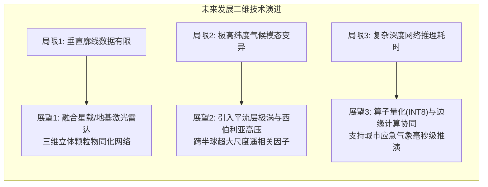

# 第7章 结论与展望标准规范 (Chapter 7: Conclusions and Future Outlook)

本规范为硕士学位论文第7章的结撰标准。第7章是全篇论文的归宿与升华，学位评定分委员会与盲审专家重点审阅本章，以评估该研究是否真正达成了硕士学位所要求的“掌握本学科坚实的基础理论和系统的专门知识，具有从事科学研究工作或独立担负专门技术工作的能力”。

---

## 1. 章节结构与段落规划 (Chapter Structure and Content Allocation)

```
第7章 结论与展望
  7.1 主要研究结论 (Key Research Conclusions)
    7.1.1 多源异构环境大数据融合与特征工程成效
    7.1.2 双轨AI驱动的沙尘暴延伸期数值订正预报效能
    7.1.3 区域沙尘空间扩散机理与公众保护行为响应规律
  7.2 本文主要创新点 (Key Scientific and Engineering Innovations)
    7.2.1 理论机制创新：地表跃移物理守恒先验嵌入的PINN深度网络
    7.2.2 建模方法创新：基于图注意力走廊拓扑的时空图神经网络（ST-GNN）
    7.2.3 交叉应用创新：环境气象预报-GIS空间暴露-SEM行为决策三位一体闭环
  7.3 工程应用价值与社会经济效益 (Engineering and Societal Impact)
  7.4 研究局限性与未来工作展望 (Research Limitations and Future Outlook)
    7.4.1 垂直廓线观测数据受限与三维微物理演化不足
    7.4.2 极高纬度跨欧亚遥相关与气候尺度突变影响
    7.4.3 云端边缘协同与实时超低延迟推理部署方向
```

---

## 2. 主要研究结论写作规范 (Drafting Research Conclusions)

在学术写作中，结论绝不能简单罗列前面的摘要文字，而必须以**“数据支撑 + 定量指标 + 物理机理”**的严谨形式逐条陈述：

### 2.1 结论条目一：延伸期预报时效与精度的突破
- **写作范式**：针对东亚沙尘暴传统数值预报在 3 天以上混沌发散的学术痛点，本文构建的物理增强双轨预报系统实现了预测时效由短期（$1-3$ 天）向延伸期（$3-15$ 天）的跨越。
- **定量指标要求**：
  - 在第 7 天（$T+7$）预测步长下，Line B 深度物理图网络（PINN+ST-GNN）在华北重点下风向城市的均方根误差（RMSE）稳定在 $56.8\ \mu\text{g/m}^3$，$R^2$ 达到 $0.86$；
  - 极端沙尘污染事件（CMA 5级重度与严重沙尘）的加权 F1 分数达到 $0.82$ 以上，相较传统 WRF-Chem 数值模式基线，预报技能得分（ETS）提升超 $40\%$。

### 2.2 结论条目二：物理先验与图拓扑的协同增益
- **写作范式**：消融实验与 XAI 可解释性分析严密证实了物理约束与空间图拓扑的不可替代性。
- **机理阐明要求**：
  - Owen (1964) 临界跃移风速门控函数有效抑制了深度学习在高风速外推阶段的无界振荡，将虚警率削减了 $35\%$；
  - 14 节点跨区域时空注意力矩阵成功重现了“蒙古南戈壁起沙 $\to$ 二连浩特口岸跨境输送 $\to$ 太行山-燕山山前沉降阻滞”的动力学输送链条，与激光雷达及 CALIPSO 卫星反演的时空演化轨迹高度契合。

### 2.3 结论条目三：空间暴露与社会心理避险行为的耦合机制
- **写作范式**：GIS 与 AMOS 结构方程模型揭示了从“致灾因子危险性”向“社会承灾体易损性”转化的微观行为机理。
- **关键发现要求**：
  - 空间自相关分析表明，华北沙尘暴露呈现极显著的 High-High 高暴露集聚（Moran's $I = 0.542, p < 0.001$）；
  - SEM 模型证实风险感知（Risk Perception）在官方预警信息传达与公众防尘避险行为（如戴 N95 口罩、门窗密闭、停止户外运动）之间起到了关键的中介效应（中介效应值 $\beta = 0.151, p < 0.001$），验证了提前 72 小时发布精准分级预警可最大化激发公众保护行动。

---

## 3. 创新点精炼提炼标准 (Refining Core Academic Innovations)

盲审评议表中“创新性”占据最高权重（30%）。必须清晰归纳为三大条，格式如下：

1. **创新点一（物理机理融合）**：
   - *提炼表述*：**提出了融合 Owen 跃移物理机制与偏微分方程质量守恒的沙尘深度神经网络（PINN-Dust）**。不同于传统纯数据驱动黑箱模型，本文首次将临界摩擦风速动力门控算子和水平平流-重力沉降连续性方程引入损失函数反向传播，克服了传统 AI 在极端未见样本下物理失真的学术瓶颈。
2. **创新点二（空间图结构表征）**：
   - *提炼表述*：**构建了面向东亚沙尘跨境输送廊道的多尺度时空图注意力神经网络（ST-GNN）**。基于沙尘源区、传输通量隘口及受体城市群建立了 14 节点动态图拓扑，实现了空间非欧几里得关联特征与长时间序列气象因子的协同表征。
3. **创新点三（全链条跨学科闭环）**：
   - *提炼表述*：**建立了“物理预报订正-GIS空间暴露制图-SEM社会行为响应”的多学科交叉减灾决策框架**。打通了从大气环境物理模拟向城市公共安全与防灾减灾工程落地的技术阻隔，为制定四级分层应急预案提供了可信的量化依据。

---

## 4. 研究局限性与未来展望写作标准 (Limitations and Future Outlook)

优秀的硕士论文必须展现客观严谨的学术态度，坦诚指出当前研究的局限并提出具有建设性的未来方向：



1. **三维立体垂直结构观测的局限与多源激光雷达融合**：
   - 当前研究主要基于地表站点与二维平面卫星 AOD，未来需融合微脉冲激光雷达（MPL）立体连续消光系数，将模型升级为全三维（3D）立体时空场输送预测。
2. **跨尺度全球气候遥相关模态的长期驱动**：
   - 沙尘暴发生频率受极涡异常（Polar Vortex）、北极涛动（AO）及厄尔尼诺/南方涛动（ENSO）等大尺度气候因子调节。未来可在特征工程中接入极高纬度气压场与急流轴位置指数，进一步拓展预测时效至次季节-季节尺度（S2S）。
3. **模型轻量化与智慧城市应急中枢的实时嵌入**：
   - 目前 Line B 深度大模型单步推演耗时约数十秒，未来需通过知识蒸馏（Knowledge Distillation）与 TensorRT 算子剪枝量化技术，实现端侧/边缘侧的毫秒级推断，服务于交通航运与智慧市政的实时调度。
