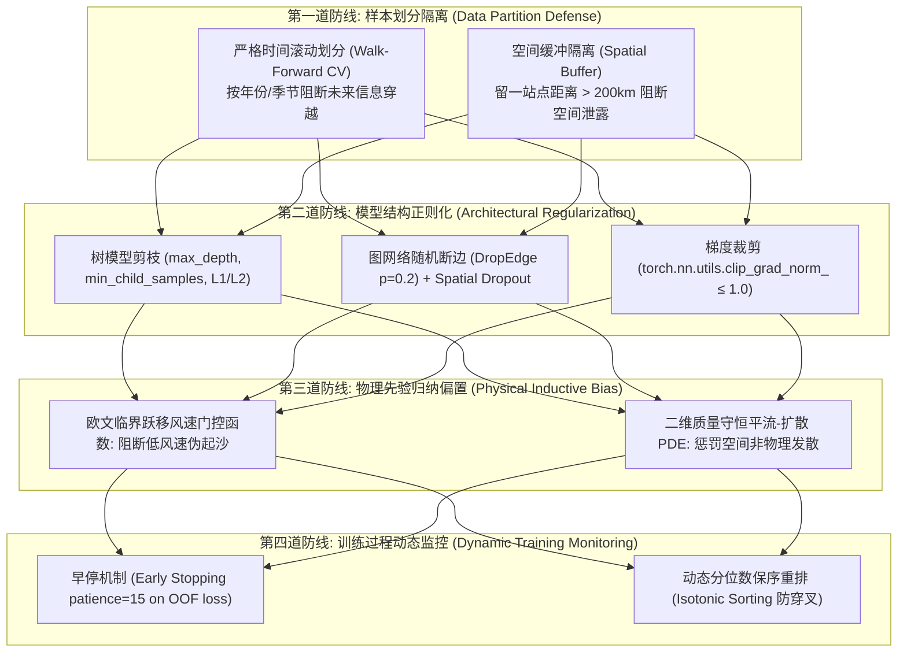

# 🛡️ 模型防过拟合与泛化性保障体系总纲 (Master Anti-Overfitting & Generalization Framework)

在环境气象与大气化学预测领域，沙尘暴事件具有**极端长尾分布（Rare Extreme Events）**、**高维气象强自相关**以及**时空异构性**等特征。若缺乏严密的防过拟合机制，模型极易陷入“记忆训练集极端值、在未见测试集或未来年份出现发散性虚警”的致命陷阱。

本体系为本项目（DustML）全技术栈的**全流程防过拟合规范指南**，涵盖机器学习（Line A）、深度物理图网络（Line B）、空间地理统计（GIS）以及社会学结构方程模型（AMOS）。

---

## 📑 防过拟合规范目录索引 (Documentation Index)

| 规范文档 | 防过拟合重点技术与核心算法 | 解决的关键学术与工程痛点 |
|:---|:---|:---|
| **[`01_MACHINE_LEARNING_OVERFITTING_PREVENTION.md`](file:///c:/Users/hp/Desktop/China_project/Planning/Prevent_Overfiting/01_MACHINE_LEARNING_OVERFITTING_PREVENTION.md)** | • 时间滚动滑动交叉验证 (Walk-Forward Temporal CV) • 树模型正则化超参数网格 (L1/L2, `min_child_samples`) • 方差膨胀因子 (VIF < 5) 与共线性剪枝 • Stacking 折外预测 (Out-of-Fold, OOF) 防标签泄露 | 杜绝时间穿越、抑制决策树叶子节点噪声记忆、消除元学习器数据泄露 |
| **[`02_DEEP_LEARNING_AND_PINN_REGULARIZATION.md`](file:///c:/Users/hp/Desktop/China_project/Planning/Prevent_Overfiting/02_DEEP_LEARNING_AND_PINN_REGULARIZATION.md)** | • PINN 物理偏微分先验作为无穷数据正则化器 • ST-GNN 图随机断边 (DropEdge) 与节点 Dropout • 余弦退火动态热身学习率调度 (Cosine Annealing + Warmup) • 自适应多任务梯度归一化平衡 (GradNorm) | 杜绝纯数据驱动黑箱在外推时的无界振荡、防止图注意力过平滑与节点强记忆 |
| **[`03_SPATIAL_AND_STATISTICAL_CROSS_VALIDATION.md`](file:///c:/Users/hp/Desktop/China_project/Planning/Prevent_Overfiting/03_SPATIAL_AND_STATISTICAL_CROSS_VALIDATION.md)** | • 空间分块交叉验证 (Spatial Block K-Fold) 与缓冲留一站法 • GWR 自适应空间带宽 AICc 惩罚控制 • AMOS 结构方程模型自由度保护 ($df \gg 0$) • 限制修正指数 (MI) 滥用与共同方法偏差 (CMB < 40%) | 克服空间自相关导致的假性高准确率、防止心理计量模型在样本上的偶然拟合 |

---

## 🎯 核心防过拟合四大防线 (Four-Tier Defense Architecture)

---

## 📊 过拟合判别量化红线 (Quantitative Overfitting Criteria)

在全流程实验中，必须严格监控以下量化指标，超出阈值立即触发警报并终止训练：

1. **训练集与验证集泛化差距（Generalization Gap Ratio）**：
   $$\text{Gap} = \frac{\text{RMSE}_{val} - \text{RMSE}_{train}}{\text{RMSE}_{train}}$$
   - **优秀**：$\text{Gap} \le 15\%$；
   - **可接受**：$15\% < \text{Gap} \le 25\%$；
   - **严重过拟合（必须重构正则化）**：$\text{Gap} > 30\%$。
2. **测试集极端分位数覆盖率（PICP）偏差**：
   - 理论置信区间为 80%（$P_{10} \sim P_{90}$），若训练集覆盖率为 95%，但未见测试集骤降至 $< 65\%$，表明置信区间过拟合，需增加分位数 Pinball 损失的正则化惩罚。
3. **空间外推泛化误差**：
   - 在完全未参与训练的盲区受体城市（如济南、青岛）上，相关系数 $R^2$ 衰减幅度不得超过基准站点的 $20\%$。
