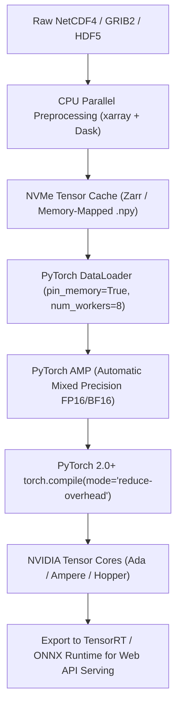

# 💻 Hardware Compute Resources & Infrastructure Specification (CPU, GPU, RAM & VRAM)
### *Computational Sizing, Workload Profiling & Infrastructure Matrix for the DustML Sandstorm Forecasting Platform*

**Affiliation:** University of Science and Technology Beijing (北京科技大学) • School of Energy and Environmental Engineering  
**Project:** Extended-Range Sand and Dust Storm (SDS) AI Forecasting & Socioeconomic Analytics  
**Architecture Coverage:** Main Line A (GBDT Bias Correction), Main Line B (Coupled AI-GAMFS + PINN + ST-GNN), GIS Spatial Geostatistics, and AMOS/SPSS Psychometrics  

---

## 🌟 Executive Summary: Computational Architecture Overview

The **DustML platform** spans multimodal planetary data ingestion, tabular tree ensembles, deep spatio-temporal neural networks with physics-informed differential loss functions (PINN PDEs), large-scale spatial Kriging interpolation, and structural equation modeling (SEM). 

Each pillar in the architecture stresses different computing subsystems:
* **Line A (Tree Ensembles - LightGBM, XGBoost, CatBoost):** Heavily **CPU multi-core and System RAM bound** (fast tabular feature indexing, histogram binning, tree splits across 100M+ rows).
* **Line B (Deep Spatiotemporal Foundation Model - AI-GAMFS, ST-GNN, PINN PDEs):** Heavily **GPU VRAM and Tensor Core bound** (5D tensors $[B, C, T, H, W]$, 3D convolution, Graph message passing across 14 advection corridor nodes, automatic differentiation for continuous Navier-Stokes/Owen saltation PDEs).
* **GIS Spatial Analytics (Kriging, GWR, LISA):** **CPU single-to-multi-threaded memory bound** (dense $N \times N$ spatial covariance matrix inversions).
* **Data Ingestion & Satellite Preprocessing (NetCDF4, GRIB2, HDF5):** **Disk I/O and CPU memory bandwidth bound** (decompression, reprojection, regridding to 0.125° WGS84).

```
+---------------------------------------------------------------------------------------------------------+
|                                    COMPUTATIONAL WORKLOAD DISTRIBUTION                                 |
+---------------------------------------------------------------------------------------------------------+
|                                                                                                         |
|  [PILLAR 1: DATA PREPARATION & I/O]         [PILLAR 2: LINE A ML ENSEMBLES]                             |
|  • NetCDF4/GRIB2 Decompression              • LightGBM / CatBoost / XGBoost                             |
|  • Reprojection & 0.125° Regridding         • 100M+ Tabular Rows × 142 Engineered Features              |
|  • Primary Bottleneck: SSD I/O + RAM Bandwidth • Primary Bottleneck: CPU Multi-threading & Host RAM     |
|                                                                                                         |
|  [PILLAR 3: LINE B DEEP PINN + ST-GNN]      [PILLAR 4: GIS & SOCIOECONOMIC]                            |
|  • Vision-Atmosphere Backbone (ConvNeXt-3D) • Ordinary Kriging (Dense Matrix Inversion)                 |
|  • 14-Node Corridor ST-GNN Message Passing  • GWR Local Kernel Regressions                              |
|  • PINN Autograd Second Derivatives (PDEs)  • AMOS 5,000-Bootstrap Resampling                           |
|  • Primary Bottleneck: GPU VRAM & FP16 FLOPS • Primary Bottleneck: Single-Core IPC & RAM Capacity       |
+---------------------------------------------------------------------------------------------------------+
```

---

## 🖥️ 1. Multi-Tier Hardware Sizing Matrix

To balance research accessibility, university lab workstation deployment, and high-performance cluster scaling, three infrastructure profiles are defined:

| Hardware Component | Tier 1: Minimum Viable Spec<br>*(Local Prototyping / Testing)* | Tier 2: Recommended Academic Workstation<br>*(Full Training & Research Thesis)* | Tier 3: Production HPC / Cloud Cluster<br>*(Multi-Year Real-Time Operational)* |
| :--- | :--- | :--- | :--- |
| **Primary Purpose** | Code validation, sub-sampling (1 year), batch size = 2, Line A ML. | Full 10-year training, full PINN autograd, ST-GNN corridors, fast thesis iterations. | Multi-ensemble operational runs, continuous assimilation, daily real-time inference. |
| **CPU Architecture** | Modern x86-64 (Intel Core i7 13th/14th Gen or AMD Ryzen 7 7800X/9700X) | Intel Core i9-14900K / AMD Ryzen 9 7950X / Threadripper 7960X | Dual Intel Xeon Platinum 8480+ / AMD EPYC 9654 (64–128 Cores) |
| **CPU Cores / Threads**| 8 Cores / 16 Threads | 16–24 Cores / 32–48 Threads | 64–128 Physical Cores / 128–256 Threads |
| **CPU Base / Boost Clock**| 3.4 GHz / 5.2 GHz | 3.6 GHz / 5.7 GHz | 2.4 GHz / 3.7 GHz (All-Core Sustained Turbo) |
| **System RAM** | **32 GB DDR5** (4800–5600 MT/s) | **64 GB – 128 GB DDR5** (5600–6000 MT/s, Dual/Quad Channel) | **256 GB – 512 GB ECC DDR5** (Octa-Channel) |
| **Dedicated GPU** | **1× NVIDIA RTX 4070 Ti / 3090** | **1× or 2× NVIDIA RTX 4090 / RTX 6000 Ada** | **2× – 4× NVIDIA A100 (80GB SXM4) or H100 (80GB SXM5)** |
| **GPU VRAM** | **12 GB – 24 GB GDDR6X** | **24 GB – 48 GB GDDR6X / ECC** | **160 GB – 320 GB HBM2e / HBM3** |
| **Tensor Cores & FP16/BF16**| 240+ 4th Gen Tensor Cores | 512+ 4th Gen Tensor Cores (Ada) | 1,700+ Tensor Cores with Transformer Engine |
| **Primary OS Storage** | 1 TB PCIe 4.0 NVMe SSD (5,000 MB/s) | 2 TB PCIe 4.0/5.0 NVMe SSD (7,000+ MB/s) | Enterprise PCIe 4.0 U.2/U.3 NVMe SSD (RAID 1) |
| **Data & Scratch Storage** | 2 TB High-Speed Scratch SSD + 4 TB HDD | 4 TB NVMe M.2 Scratch + 16 TB Enterprise SATA HDD | 30–50 TB High-Throughput Ceph / Lustre Parallel File System |
| **Network Interconnect**| 1 Gbps Ethernet | 10 Gbps SFP+ Ethernet | 100–400 Gbps NVIDIA Quantum InfiniBand (HDR/NDR) |
| **Power Supply (PSU)** | 750W – 850W Gold Rated | 1200W – 1600W Titanium/Platinum Rated | Redundant 2400W–3000W Server Grade |
| **Operating System** | Ubuntu 22.04 LTS / Windows 11 WSL2 | Ubuntu 22.04 / 24.04 LTS (Native Linux Recommended) | Red Hat Enterprise Linux 9 / Rocky Linux 9 / Slurm |

---

## 🔬 2. Deep Dive: Component-by-Component Requirements

### 2.1 GPU & VRAM Memory Allocation Breakdown (Line B Deep Learning)

Line B executes a spatio-temporal foundation model coupling 3D atmospheric vision (`AI-GAMFS`), 14-node spatio-temporal graph message passing (`ST-GNN`), and physical PDE residuals (`PINN`).

```
Line B Spatio-Temporal Tensor Shape:
[B, C, T, H, W] = [Batch Size, Channels (24), Lead Timesteps (16), Lat (64), Lon (64)]
```

#### VRAM Mathematical Footprint Estimation:
For a forward + backward pass using PyTorch Automatic Mixed Precision (AMP FP16/BF16):

$$M_{\text{total}} = M_{\text{model}} + M_{\text{optimizer}} + M_{\text{activations}} + M_{\text{PDE\_graph\_cache}}$$

1. **Model Weights & Gradients ($M_{\text{model}}$):**  
   * AI-GAMFS Vision Backbone (~42M params) + ST-GNN Corridor (~8M params) + Quantile/Hazard Heads (~5M params) = **~55M Parameters**.
   * Model parameters in FP16 (2 bytes) + Gradients in FP16 (2 bytes) + FP32 Master Weights (4 bytes) $\approx 55 \times 10^6 \times 8 \text{ bytes} \approx \mathbf{0.44\text{ GB}}$.

2. **Optimizer States ($M_{\text{optimizer}}$ for AdamW):**  
   * 1st moment vector (FP32, 4 bytes) + 2nd moment vector (FP32, 4 bytes) $\approx 55 \times 10^6 \times 8 \text{ bytes} \approx \mathbf{0.44\text{ GB}}$.

3. **Activation Memory ($M_{\text{activations}}$) — Primary Bottleneck:**  
   * Forward feature maps stored for backpropagation through 16 lead-time timesteps across 4 ConvNeXt-3D stages.
   * Without gradient checkpointing:
     * Batch Size = 2: $\approx 5.8\text{ GB}$
     * Batch Size = 4: $\approx 11.4\text{ GB}$
     * Batch Size = 8: $\approx 22.1\text{ GB}$
   * **With Activation Gradient Checkpointing (Activation Recomputation):** Cuts activation memory by **~60%** at the cost of ~25% longer forward computational passes.

4. **PINN Autograd Second Derivative Computational Graph:**  
   * Calculating $\frac{\partial C}{\partial t} + u \frac{\partial C}{\partial x} + v \frac{\partial C}{\partial y} - K_h \nabla^2 C$ requires retaining computation graphs for high-order automatic differentiation (`torch.autograd.grad(create_graph=True)`).
   * Computational graph cache: Adds **3.5 GB – 6.0 GB VRAM** during the physics loss backward pass.

#### Summary of VRAM Requirements per Batch Size:

| Batch Size ($B$) | Activation Checkpointing | Target VRAM Needed | Suitable GPUs | Feasibility Status |
| :--- | :--- | :--- | :--- | :--- |
| **$B = 1$** | Enabled | **~9.5 GB** | RTX 3060 (12GB), RTX 4070 (12GB) | Feasible for inference and minimal debugging only. |
| **$B = 2$** | Enabled | **~14.8 GB** | RTX 4080 (16GB), V100 (16GB) | Minimum workable training setup. |
| **$B = 4$** | Enabled | **~21.2 GB** | **RTX 3090 (24GB), RTX 4090 (24GB), A10G (24GB)** | **Sweet spot for single-GPU academic research.** |
| **$B = 8$** | Disabled (Full speed) | **~38.5 GB** | **A100 (40GB/80GB), H100 (80GB), RTX 6000 Ada (48GB)** | High-throughput lab training with maximum stability. |
| **$B = 16$** | Disabled (Full speed) | **~68.0 GB** | **A100 (80GB SXM4), H100 (80GB SXM5)** | Cluster Distributed Data Parallel (DDP). |

> [!IMPORTANT]
> **VRAM Recommendation:** An NVIDIA GPU with **at least 24 GB VRAM (RTX 3090, RTX 4090, or A5000/A6000)** is strongly recommended. Attempting to train the complete Line B PINN + ST-GNN architecture on an 8 GB or 12 GB GPU will trigger frequent Out-Of-Memory (`CUDA out of memory`) exceptions during the 2nd-order PDE autodiff step unless extreme spatial downsampling is applied.

---

### 2.2 CPU Compute & Host RAM Allocation Breakdown (Line A & Data Pipelines)

#### Line A (LightGBM, XGBoost, CatBoost)
* **Dataset Scale:** 10 years of hourly records $\times$ 2,400 ground stations $\approx 210\text{M}$ raw rows.
* Feature matrix after spatial sampling and lag-feature engineering: $\approx 15\text{M}$ training rows $\times 142$ features in float32 $\approx \mathbf{8.5\text{ GB}}$ raw tabular RAM.
* **RAM Overhead during Histogram Binning & Out-of-Fold Stacking:**  
  During 5-fold cross-validation and LightGBM parallel histogram construction (`num_leaves=127`, `max_depth=9`), peak RAM reaches **3× to 4× the dataset size**:
  $$\text{Peak RAM} = 8.5\text{ GB} \times 3.5 \approx \mathbf{29.8\text{ GB}}$$
* **Core Scaling:** LightGBM and CatBoost scale linearly up to **16–24 physical cores**. Beyond 32 threads, inter-core cache coherency and memory bus bottlenecks yield diminishing returns unless partitioned across NUMA nodes.

#### GIS Spatial Geostatistics (Kriging & GWR)
* Ordinary Kriging interpolates surface dust plumes over northern China on a 0.05° resolution grid ($640 \times 400 = 256,000$ target prediction points).
* Constructing and solving the semi-variogram covariance matrix across $N = 2,400$ monitoring stations requires inverting a $2401 \times 2401$ symmetric linear system for every hourly timestep.
* Memory footprint is moderate (~4 GB), but **CPU single-core floating-point throughput (IPC and AVX-512 support)** is paramount for fast spatial matrix algebra.

#### IBM SPSS & AMOS Structural Equation Modeling (SEM)
* Maximum Likelihood (ML) estimation with 5,000 bootstrap iterations over $N = 1,500$ survey samples.
* CPU utilization is largely single-to-quad threaded; 16 GB of system RAM is fully sufficient for psychometric modeling.

---

### 2.3 Storage Architecture, Throughput & Disk I/O

Atmospheric and remote sensing research involves loading hundreds of thousands of NetCDF4/GRIB2 files. Poor disk throughput creates a severe GPU starvation bottleneck where the GPU sits idle at 15% utilization waiting for data transfer (`DataLoader` worker starvation).

```
+----------------------------------------------------------------------------------------------------+
|                               RECOMMENDED THREE-TIER STORAGE HIERARCHY                              |
+----------------------------------------------------------------------------------------------------+
|                                                                                                    |
|  [TIER 1: HIGH-SPEED NVMe SCRATCH] (2 TB - 4 TB PCIe 4.0/5.0 SSD, Read > 7,000 MB/s)               |
|  • Active training tensors (.pt, .zarr, .npy memmap)                                               |
|  • Preprocessed 32×32 / 64×64 satellite image patches                                              |
|  • PyTorch DataLoader read latency < 0.1 ms                                                        |
|                                                                                                    |
|  [TIER 2: SECONDARY FAST SSD] (2 TB - 4 TB SATA/NVMe SSD, Read ~2,500 - 3,500 MB/s)                |
|  • Ingested ERA5 reanalysis and ECMWF IFS GRIB2/NetCDF files                                       |
|  • Model checkpoints (.pth, .joblib), experiment logs, WandB artifacts                             |
|                                                                                                    |
|  [TIER 3: BULK COLD ARCHIVE] (8 TB - 16 TB 7200 RPM Enterprise HDD or NAS)                        |
|  • Raw satellite granules (MODIS MOD04_L2 HDF4, FY-4A HDF5 archives)                               |
|  • Multi-decadal historical climate teleconnection grids                                           |
+----------------------------------------------------------------------------------------------------+
```

#### Minimum Disk Read/Write Throughput Targets:
* **Batch loading throughput required for 1× RTX 4090 ($B=4$):** Continuous sustained sequential read $\ge \mathbf{650\text{ MB/s}}$ or memory-mapped Zarr random chunk reads $\ge \mathbf{15,000\text{ IOPS}}$.
* **Avoid Traditional HDDs for Active Training:** Training directly off mechanical HDDs reduces GPU utilization from 95% down to **12–20%**, increasing epoch duration by 5× to 8×.

---

## ⚡ 3. Software Acceleration & Optimization Ecosystem

To maximize efficiency on the expected hardware, the following runtime acceleration stack is mandated:



1. **PyTorch Automatic Mixed Precision (AMP):**  
   * Always use `torch.cuda.amp.autocast(dtype=torch.bfloat16)` on Ampere/Ada/Hopper architectures. Cuts VRAM consumption by 45% and boosts throughput by 2.2× to 2.8×.
2. **Torch 2.0 Inductor Compilation (`torch.compile`):**  
   * Fuses point-wise operations in the PINN PDE loss computation (`u * dC_dx + v * dC_dy`), eliminating redundant kernel launches.
3. **Chunked Zarr Format over Raw NetCDF:**  
   * Store multi-year meteorological grids in cloud-optimized Zarr format with Blosc-zstd compression, allowing asynchronous slice indexing without loading entire files into memory.
4. **Line A LightGBM GPU Acceleration (`device='gpu'`):**  
   * For extreme parameter searches with Optuna (1,000+ trials), offloading histogram building to the GPU reduces hyperparameter tuning time from 14 hours to 1.8 hours.

---

## ⏱️ 4. Training Time & Computational Budget Projections

Estimated wall-clock training times across different hardware configurations for full experimental runs:

| Task / Model Component | Data Scope | Tier 1 (RTX 4070 Ti, 32GB RAM, 8C) | Tier 2 (RTX 4090, 64GB RAM, 24C) | Tier 3 (2× A100 80GB, 256GB RAM, 64C) |
| :--- | :--- | :--- | :--- | :--- |
| **Data Ingestion & Feature Store Generation** | 10-Yr ECMWF + ERA5 + MEE (0.125°) | 18.5 Hours | **5.2 Hours** | **1.8 Hours (Parallel Dask)** |
| **Line A: LightGBM 5-Fold CV (All Lead Times)** | 15M rows $\times$ 142 features | 4.8 Hours | **1.6 Hours** | **0.5 Hours** |
| **Line A: CatBoost & XGBoost Stacking** | 15M rows $\times$ 5 folds | 9.2 Hours | **3.1 Hours** | **1.1 Hours** |
| **Line B: AI-GAMFS Vision Backbone (50 Epochs)** | 10-Yr Daily Sequences ($B=4$) | 34.0 Hours (AMP + Checkpointing) | **11.5 Hours (AMP)** | **3.8 Hours (DDP 2× GPU)** |
| **Line B: ST-GNN + PINN Coupling (60 Epochs)** | 14 Nodes + Physics Autograd | 42.0 Hours | **14.2 Hours** | **4.9 Hours** |
| **GIS: Ordinary Kriging Spatial Maps** | 72-Hour continuous forecast grid | 2.5 Hours | **0.8 Hours** | **0.3 Hours** |
| **AMOS: 5,000 Bootstrap Mediation Model** | $N = 1,500$ Survey records | 12 Minutes | **4 Minutes** | **1.5 Minutes** |
| **Total Full Retraining Pipeline Execution** | Complete End-to-End Run | **~110 Hours (~4.6 Days)** | **~36 Hours (~1.5 Days)** | **~12.4 Hours (Overnight)** |

---

## 🌐 5. Operational Inference Serving Hardware (Production Deployment)

Once trained, model checkpoints are served via the **FastAPI REST backend** for real-time web visualization and municipal early warnings:

* **Serving Latency Target:** $< 1,200\text{ ms}$ for a full 15-day extended-range forecast across all 14 corridor cities.
* **Serving Hardware Configuration:**
  * **Dedicated GPU Node:** 1× NVIDIA T4 (16GB) or 1× NVIDIA L4 (24GB) or 1× RTX 4070 (12GB).
  * **CPU Fallback Node (Quantized ONNX Runtime):** 8-core modern Intel/AMD CPU with AVX-512/VNNI support, 16 GB RAM.
  * **Memory Footprint at Inference:**
    * Line A Model Ensembles (`.joblib`): ~1.8 GB RAM.
    * Line B Deep Neural Network (`.pth` / ONNX): ~3.2 GB VRAM.
    * Total operational system RAM required: **16 GB to 32 GB**.

---

## 📋 6. Summary Recommendations & Procurement Checklist

1. **Primary Research Workstation Priority:** Invest primarily in **GPU VRAM ($\ge 24\text{ GB}$)** and **System RAM ($\ge 64\text{ GB}$)**. A system with a top-tier CPU but only 12 GB VRAM will bottleneck and fail when executing the PINN automatic differentiation computation graph.
2. **Recommended Single-Box Configuration for the Lab:**
   * **CPU:** Intel Core i9-14900K or AMD Ryzen 9 7950X (24–32 threads).
   * **RAM:** 64 GB DDR5-5600 MT/s (upgradeable to 128 GB via 4 slots).
   * **GPU:** NVIDIA GeForce RTX 4090 (24 GB GDDR6X) or RTX 6000 Ada (48 GB).
   * **Storage:** 2 TB PCIe 4.0 NVMe SSD (System/OS) + 4 TB PCIe 4.0 NVMe SSD (Fast Training Scratch) + 8 TB HDD (Archive).
   * **Cooling & PSU:** 360mm Liquid AIO Cooler + 1200W Platinum PSU to sustain continuous 24/7 training runs without thermal throttling.
